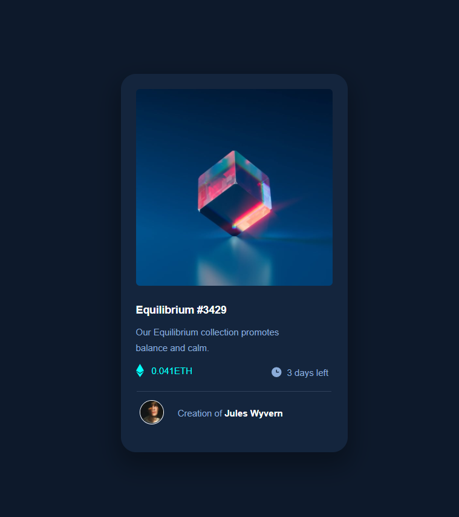

# Frontend Mentor - NFT preview card component solution
This is a solution to the NFT preview card component challenge on Frontend Mentor. Frontend Mentor challenges help you improve your coding skills by building realistic projects. www.frontendmentor.io  

## Overview

### The Challenge
Users should be able to:

- View the optimal layout depending on their device's screen size
- See hover states for interactive elements

### Links:

- View on Frontendmentor: [Frontend Mentor](https://www.frontendmentor.io/solutions/nftpreviewcard-T7PXRHu47)
- Live Site URL: [Live Project] (https://harry2gks.github.io/Frontend_Mentor_nft-preview-card/)

### Built with:

- Semantic HTML5 markup
- CSS custom properties
- CSS flexbox

## Author

- Frontend Mentor - [Frontend Mentor](https://www.frontendmentor.io/profile/Harry2gks)
- Twitter: [@HKatsaris](https://twitter.com/HKatsaris)
- DEV.to: [DEV.to](https://dev.to/harry2gks)
